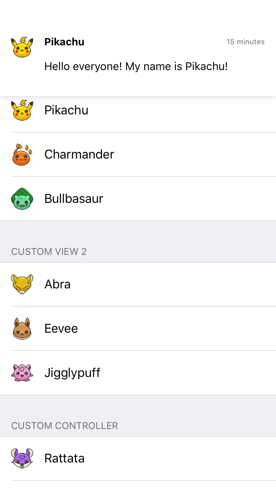
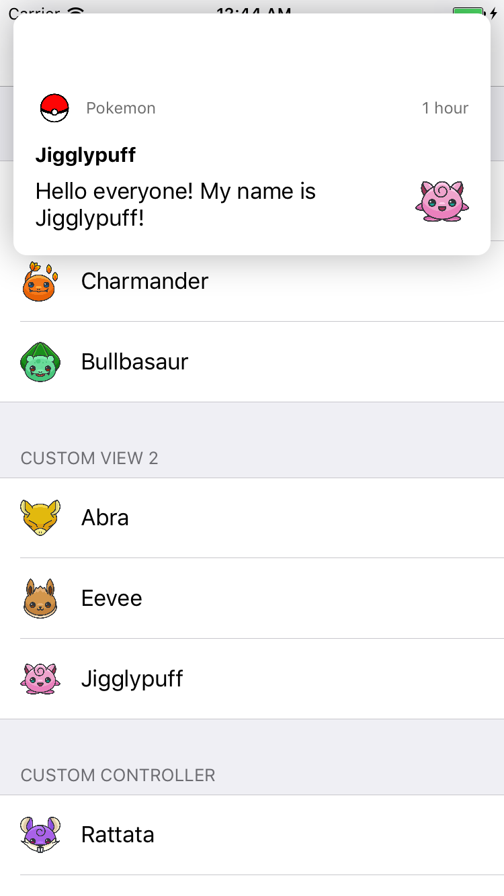

# DTLocalNotification

[](http://cocoapods.org/pods/DTLocalNotification)
[](http://cocoapods.org/pods/DTLocalNotification)
[](http://cocoapods.org/pods/DTLocalNotification)

## Screenshots
<p align="left" >
  
  
<p/>

## Usage
In order to present a local notification, it is required to have a DTLocalNotification instance before asking the presenter to show it:

```swift
let view = ExampleView(data: data)
let notification = DTLocalNotification(view: view)

DTLocalNotificationPresenter.shared.showNotification(notification, completion: nil)
```

```swift
let notification = CustomLocalNotificationViewController(data: data)

DTLocalNotificationPresenter.shared.showNotification(notification, completion: nil)
```
As you can see, there are two different ways to present a local notification. The second way is usually more efficient when you want to present local notification view in a custom DTNotificationViewController(custom view layout, status bar style, backgroundColor, etc).

<br/>
DTLocalNotificationPresenter and DTInteractiveLocalNotificationPresenter are two default presenters for presenting notification. In case you want to change the behaviors or animations or add more functionalities, simply subclass one of these two classes and make your own implementation.

## Example

To run the example project, clone the repo, and run `pod install` from the Example directory first.

## Requirements
### iOS 9.0+

## Installation

DTLocalNotification is available through [CocoaPods](http://cocoapods.org). To install
it, simply add the following line to your Podfile:

```ruby
pod 'DTLocalNotification'
```

## Author

Tung Vo, tung98.dn@gmail.com

## License

DTLocalNotification is available under the MIT license. See the LICENSE file for more info.
